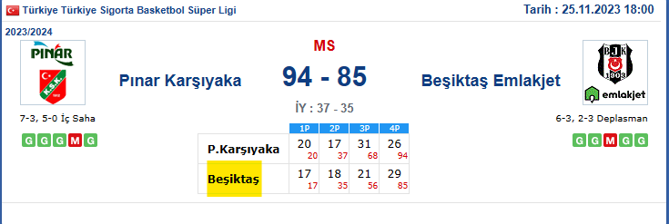

## How TO:

- First find a match to investigate on arsiv.mackolik.com


- Click at each team and copy the page link and paste it as the URL for corresponding teams.
- Before entering the team name, look for a previous match of each team, highlighted text should be entered as team
  name.
  
- Enter the amount of matches you want to take average of. Haven't added a functionality for checking all previous games
  before that match. So be carefull.

### Sample Input

```
Enter the number of teams: 2
Enter team name (as it appears on Mackolik): Fenerbahçe Beko
Enter Mackolik URL for Fenerbahçe Beko: https://arsiv.mackolik.com/Basketbol-Takim/25/Fenerbahce-Beko
Enter the number of recent games to analyze for Fenerbahçe Beko: 9
Enter team name (as it appears on Mackolik): Beşiktaş
Enter Mackolik URL for Beşiktaş: https://arsiv.mackolik.com/Basketbol-Takim/27/Besiktas-Emlakjet
Enter the number of recent games to analyze for Beşiktaş: 9

Expected Result;

Fenerbahçe Beko average scores per quarter: {'1P': 24.444444444444443, '2P': 19.666666666666668, '3P': 22.666666666666668, '4P': 22.88888888888889}
Beşiktaş average scores per quarter: {'1P': 20.88888888888889, '2P': 18.333333333333332, '3P': 18.444444444444443, '4P': 18.11111111111111}
```

## TODOs:

- [ ] Error Handling: Implement error handling for network requests and invalid inputs. This can prevent the script from
  crashing unexpectedly and provide user-friendly error messages.
- [ ] Caching Mechanism: If the same team's data is frequently analyzed, consider implementing a caching mechanism to
  store previously fetched game data. This can reduce network calls and speed up the script.
- [ ] Logging: Implement logging to track script execution, especially useful for debugging and monitoring script
  performance.
- [ ] Configuration File: Instead of input prompts, consider using a configuration file (like JSON or YAML) where users
  can predefine team names, URLs, and number of games. This is especially useful for repetitive tasks with the same
  parameters.
- [ ] Modular Design: Refactor the code into smaller functions or even separate modules for better maintainability and
  readability. This also makes it easier to extend features in the future.
- [ ] User Interface: For non-technical users, consider developing a simple graphical user interface (GUI) using
  libraries like Tkinter or PyQt.
